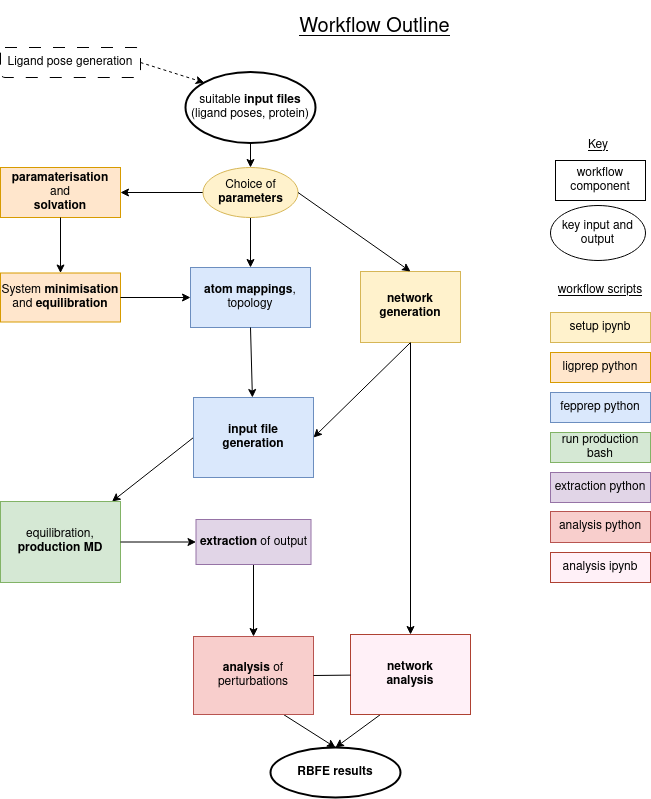

# pipeline

### To install the code:

First, create a conda/mamba environment:

`conda create --name pipeline python=3.9 pip`

Install requirements:

`conda install -c conda-forge openmm=7.7.0 openff-toolkit openff-interchange openff-units openff-utilities openff-forcefields lomap2`

`conda install -c openbiosim/label/dev sire==2023.3`

and also install the requirements listed:

`pip install -r requirements.txt`

Clone the correct BioSimSpace version (https://github.com/michellab/BioSimSpace/releases/tag/RBFE-benchmark) and install this in the environment.

Follow the instructions there to install the branch.

Finally, go to the python directory and install the pipeline in the environment using:

`python setup.py install`

To run additional network analysis using either FreeEnergyNetworkAnalysis (https://github.com/michellab/FreeEnergyNetworkAnalysis) or MBARNet (https://gitlab.com/RutgersLBSR/fe-toolkit), please follow their instructions for installation and use. Default network analysis proceeds using cinnabar.

### Outline of folders:

pipeline_notebooks - notebooks and scripts for starting and analysing the pipeline

python - contains all the code 

other_scripts - contains additional notebooks.

### Outline of the pipeline:

After the initial setup of the pipeline (pipeline_notebooks folder), a main folder with the settings in `execution_model` should have been created. This contains the `ligands.dat`, `network.dat`, `protocol.dat`, and `analysis_protocol.dat` that can be edited as required. In the main folder, running: `bash run_all_slurm.sh` will start the entire pipeline for a slurm workload manager in a series of dependencies. The run_*_slurm scripts generated in the `scripts` folder may need to be adjusted depending on the slurm cluster and resources available. After all the runs are finished, they can be analysed in a jupyter notebook following the example in the pipeline_notebooks folder.

The workflow and scripts are outlined in the figure below:

